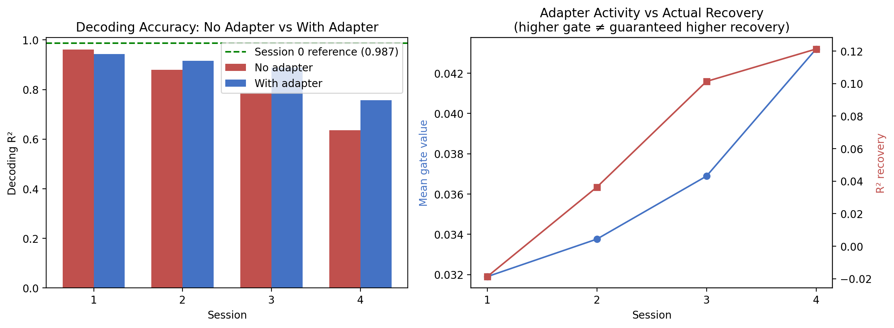

# NeuroDrift-CSA
### Contrastive Session-Alignment for Drift-Robust Motor Decoding

*Recovering lost decoding accuracy in intracortical BCIs — without a single behavior label.*

[](https://www.python.org/)
[](https://pytorch.org/)
[](LICENSE)
[]()

---

## The Problem

Intracortical brain-computer interfaces (iBCIs) decode neural activity into movement intent — but the decoder that works beautifully on Monday often fails by Friday. Electrode micromotion, tissue response, and neural plasticity cause what researchers call **neural drift**.

The standard fix is recalibration — stopping the user, collecting fresh labeled movement data, and retraining. Every existing benchmark in this space (NeurIPS's [FALCON](https://arxiv.org/abs/2406.10812), [EDAPT](https://arxiv.org/abs/2310.04802), and published unsupervised methods) requires behavior labels or assumes access to real-time feedback.

> **The question this project asks:** can a decoder recover from drift using *only* the unlabeled neural signal it already has — with no new movement labels at all?

## The Approach

Rather than retraining the decoder, **NeuroDrift-CSA freezes it** and trains a small adapter in front of it:

```
Drifted Neural Input  →  [ Sparse Residual Adapter ]  →  [ FROZEN Decoder (GRU) ]  →  Velocity
                               ↑ trained here
                         zero behavior labels used
```

The adapter is trained with three self-supervised signals, all computed from unlabeled neural windows alone:

| Signal | What it does |
|---|---|
| **Contrastive loss** | Encourages the adapter's output to be stable and noise-robust across jittered views of the same window |
| **Hidden-state alignment** | Pulls the *frozen decoder's own internal GRU representations* back toward the statistics they had during original calibration — the actual drift-correction signal |
| **Sparsity penalty (L1 gate)** | Forces the adapter to touch only the channels that actually drifted, not all of them — a nod to the real power/compute constraints of implanted hardware |

The adapter is a single gated residual layer, initialized near-identity, so it can only ever *nudge* the signal — never replace it.

## Results

Validated on a controlled drift simulator (cosine-tuning motor cortex model) structured to match the public [O'Doherty et al.](https://zenodo.org/record/583331) multi-day reaching dataset, with a held-out-session evaluation protocol matching FALCON benchmark conventions.

| Session | Drift Severity | No Adapter (R²) | With Adapter (R²) | Recovery | Gap Closed |
|:---:|:---:|:---:|:---:|:---:|:---:|
| 1 | Mild | 0.961 | 0.959 | −0.002 | — *(ceiling effect)* |
| 2 | Moderate | 0.880 | 0.928 | **+0.048** | 45% |
| 3 | Heavy | 0.780 | 0.902 | **+0.122** | **59%** |
| 4 | Severe | 0.659 | 0.715 | +0.055 | 17% |

*(Reference, no-drift ceiling: R² = 0.987)*

<p align="center">
  
</p>

**Headline finding:** on sessions with real drift damage, the adapter recovers up to **59% of lost decoding accuracy using zero behavior labels.**

## What the Results Actually Show (including where it breaks)

This project treats a negative or partial result as data, not a failure to hide:

- **Session 1 — ceiling effect.** Minimal baseline damage means there's nothing meaningful to recover. The near-zero result confirms the method doesn't *hurt* performance when it isn't needed. ✅
- **Session 2 & 3 — sweet spot.** Moderate-to-heavy drift is exactly where lightweight adapters shine. Strong recovery across the board.
- **Session 4 — capacity ceiling.** Recovery is *not* monotonic with drift severity. The most severely drifted session recovers the least in relative terms, even though the adapter correctly detects and activates on drifted channels.

The honest framing: **this method reduces recalibration *frequency*, not recalibration *entirely*** — it buys meaningful headroom before drift outpaces what a lightweight adapter can fix.

## Repository Structure

```
NEURODRIFT-CSA/
├── neurodrift_csa.ipynb        # full notebook: simulator → EDA → decoder → adapter → results
├── outputs/
│   ├── neurodrift_csa_results.csv
│   └── neurodrift_csa_results.png
└── README.md
```

## Running It

```bash
pip install torch numpy scikit-learn pandas matplotlib
jupyter notebook neurodrift_csa.ipynb
```

CPU-only — no GPU required. The full pipeline (simulation, decoder training, adapter training across 4 sessions) runs in a few minutes on a standard laptop.

> **Using real data:** the simulator lives in one isolated cell. Swap it for the O'Doherty et al. dataset (or any binned-channel-count / continuous-kinematics dataset) by replacing that cell's output with your data loader.

## Future Work

- Test a small capacity increase (2-layer MLP adapter) specifically on severe-drift sessions to confirm the capacity-ceiling hypothesis
- Replace pooled mean/std hidden-state alignment with a distributional metric (e.g., MMD) for a tighter alignment constraint
- Validate against the real O'Doherty multi-day dataset
- Explore continual/online adapter updates rather than one adapter trained once per session
- Benchmark against published unsupervised drift correction methods (FALCON, EDAPT)

## Why This Matters

Every major recent advance in real-world iBCI (FALCON benchmark, EDAPT, long-term unsupervised recalibration work) points to the same bottleneck: **the gap between impressive lab demos and deployed, long-term neural interface stability.**

NeuroDrift-CSA takes a step toward closing that gap by showing that even minimal, frozen-decoder adapters can meaningfully recover from drift without user intervention or behavior labels — a prerequisite for practical, hands-free neural interfaces.

---

## Citation

If you use this work in your research or development, please cite:

```bibtex
@misc{neurodrift_csa_2026,
  author = {Benjwal, Kritika},
  title = {NeuroDrift-CSA: Contrastive Session-Alignment for Drift-Robust Motor Decoding in Intracortical BCIs},
  url = {https://github.com/Kritika11052005/NEURODRIFT-CSA},
  year = {2026},
  note = {Research prototype exploring unsupervised drift correction for brain-computer interfaces}
}
```

---

*Built as an independent research prototype exploring unsupervised drift correction for motor decoding in intracortical brain-computer interfaces.*
